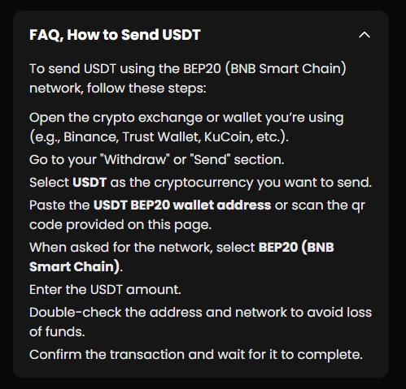
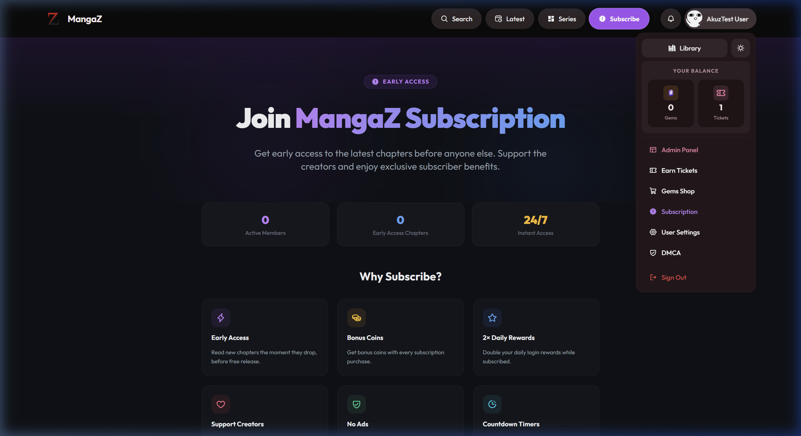

# GrodexTT - Professional Manga & Scanlation Platform 📚

MangaZ is a next-generation, high-performance manga reading and scanlation management platform. Designed with a "Premium-First" philosophy, it combines a sleek, distraction-free reader with a robust monetization engine and an enterprise-grade admin dashboard.

---

## 🌟 Vision & Design
GrodexTT isn't just a reader; it's an ecosystem for scanlation groups and content creators. Built with **React**, **Vite**, and **Tailwind CSS**, it leverages **Supabase** for a serverless yet powerful backend, ensuring lightning-fast performance across any device.

- **Mobile Optimized**: A fluid, responsive UI designed for reading on the go.
- **Visual Excellence**: Modern typography (Outfit/Inter), consistent HSL color palettes, and glassmorphism effects.
- **Dark Mode Native**: A curated "High-Contrast Dark" theme that prioritizes reader comfort.
- **Micro-Animations**: Smooth transitions and interactive elements powered by Framer Motion.

---

## 🚀 Key Features

### 📖 Immersive Reading Experience
- **Advanced Reader Settings**: Toggle between Long Strip, Single Page, and Double Page modes. Includes greyscale mode, dimming controls, and custom strip margins.
- **Reading Progress**: Automatically tracks your last read chapter and page.
- **Smart Early Access**: Dynamic badges that automatically transition from "Early Access" to "Free" based on adjustable release timers (Subscription vs. Free Release dates).
- **Library Management**: One-click bookmarking with a dedicated user dashboard to track your collection.

### 💰 Monetization & Economy System
- **Cryptomus Integration**: Fully integrated white-labeled crypto payment gateway. Accept **USDT (BEP-20/BSC)** and other cryptocurrencies with zero-redirect checkout.
- **Tiered Subscriptions**: Customizable subscription plans (e.g., Weekly, Monthly, Yearly) with custom names, prices, and benefit descriptions.
- **Coin System**: A virtual currency system for unlocking individual premium chapters. Support for custom currency names and icons.
- **Stripe & PayPal**: Traditional payment support for Global users.
- **In-Site Checkout**: Professional payment modals with dynamically generated QR codes and real-time transaction polling.

### 🛡️ Enterprise-Grade Admin Panel
- **Manga Management**: Effortless title creation, chapter uploads, and metadata editing.
- **Multi-Cloud Storage**: Integrated support for **Google Cloud (Blogger)**, **Imgur**, and **Supabase Storage** for unlimited horizontal scaling.
- **User Management**: Granular control over user roles (Admin, Moderator, Subscriber), balance adjustments, and manual subscription granting.
- **Site Configuration**: Real-time control over global settings, payment toggles, and UI branding through a centralized dashboard.
- **Discord Webhooks**: Automatically notify your community when new chapters are published.
- **Audit Logs**: Deep security tracking for administrative actions.

---

## 🔒 Security & Hardening

MangaZ includes several levels of production-grade security:
1. **Row Level Security (RLS)**: Sensitive tables like `site_settings`, `user_roles`, and `audit_logs` are locked behind strict "Admin-only" policies.
2. **Database Triggers**: Critical fields (like `coin_balance` and `token_balance`) are protected by `BEFORE UPDATE` triggers to prevent unauthorized modifications by non-admin users.
3. **Internalized Logic**: Key payment configurations (Client IDs, Secret Keys) are stored in a secured `premium_general` setting that is never exposed to the public frontend.
4. **JWT Verification**: All Edge Functions strictly verify user identity before processing requests.

---

## 📸 Platform Showcases

### 💳 Seamless Payments
The platform features a native, white-labeled checkout experience. Everything stays within MangaZ to ensure trust and conversion.

### 💎 Premium Membership
Offering tiers of access to your readers has never been easier. The subscription system is fully synced with the UI, including custom badges in comments and the navbar.

---

## 🏗️ Technical Stack

| Component | Technology |
| :--- | :--- |
| **Frontend** | React 18, Vite, TypeScript |
| **Styling** | Tailwind CSS, shadcn/ui |
| **Backend** | Supabase (PostgreSQL, Auth, RLS) |
| **Logic** | Deno-based Edge Functions |
| **Payments** | Cryptomus, Stripe, PayPal |
| **Optimization** | Manual Chunking, Build Minification |

---

## 📜 Updates & Changelog (Recent)

### Version 1.2
- **NEW**: Full security migration with RLS hardening and database triggers.
- **NEW**: Refactored Chapter Badge logic to support dual release dates (Sub-free vs. Public-free).
- **NEW**: Integrated Cryptomus for USDT (BSC) payments with automatic balance crediting.
- **CLEANUP**: Removed legacy NOWPayments and Razorpay integrations for a cleaner codebase.
- **CLEANUP**: Optimized build configuration for faster load times.
- **UI**: Added a professional Privacy Policy page and improved the DMCA accessibility.

---

## ⚖️ License & Proprietary Notice

**© 2026. All Rights Reserved.**

This software is **proprietary and confidential**. It is NOT open source. Any unauthorized copying, modification, distribution, or use of this software without explicit permission from the copyright holder is strictly prohibited. 

MangaZ is the intellectual property of its creator. The copyright holder reserves the right to claim damages in the event of license violations or intellectual property theft.

**Repository ownership**: [akuzenaiarts-cloud/MangaZ](https://github.com/akuzenaiarts-cloud/MangaZ)
